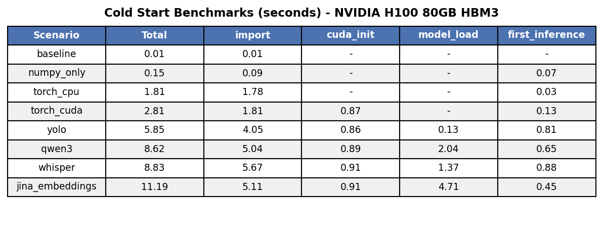
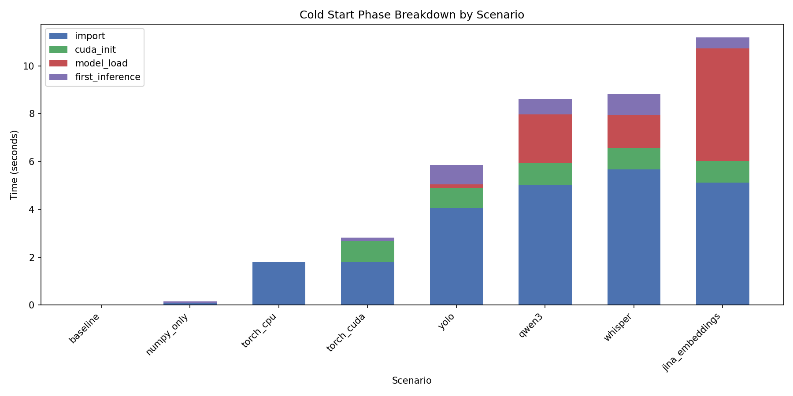

<div align="center">

# ❄️ Kryo

**Sub-second cold starts for GPU inference**

*pronounced 'cry-oh'*

[](https://www.rust-lang.org/) [](LICENSE)

</div>

---

## Table of Contents

- [❄️ Kryo](#️-kryo)
  - [Table of Contents](#table-of-contents)
  - [The Problem](#the-problem)
  - [The Solution](#the-solution)
  - [How It Works](#how-it-works)
  - [Requirements](#requirements)
  - [Installation](#installation)
  - [Usage](#usage)
    - [Create a snapshot](#create-a-snapshot)
    - [Restore and run](#restore-and-run)
    - [Manage snapshots](#manage-snapshots)
    - [Other](#other)
    - [Examples](#examples)
  - [Benchmarks](#benchmarks)

---

## The Problem

GPU inference has slow cold starts. A model that runs in milliseconds takes **5-10+ seconds to start**.

| Phase                                | Time      |
| ------------------------------------ | --------- |
| Python imports (torch, transformers) | 3-5s      |
| CUDA initialization                  | ~0.9s     |
| Model loading                        | 0.1-5s    |
| **Total cold start**                 | **5-11s** |

This makes serverless difficult and requires keeping instances warm to avoid startup overhead, defeating scale-to-zero.

## The Solution

Checkpoint your process after setup. Restore in milliseconds.

```python
# app.py
import kryo

model = load_model()      # Heavy setup
model.to("cuda")
kryo.checkpoint()         # Freeze here

result = model(input)     # Runs after restore
```

```bash
# Create snapshot (runs setup, freezes at checkpoint)
kryo snapshot create --name llm -- python app.py

# Restore and run (skips setup, continues from checkpoint)
kryo run --snapshot llm
```

> **~100ms** restore instead of **5-11s** cold start

## How It Works

Kryo combines [CRIU](https://criu.org/) (process checkpointing) with NVIDIA's [cuda-checkpoint](https://github.com/NVIDIA/cuda-checkpoint) (GPU state management).

```mermaid
sequenceDiagram
    participant K as Kryo CLI
    participant P as Your Process
    participant G as GPU State

    rect rgb(40, 40, 40)
    note over K,G: kryo snapshot create
    K->>P: Spawn process
    P->>P: Imports, model load, warmup
    P->>K: SIGUSR1 (ready)
    K->>G: Suspend CUDA state
    K->>P: CRIU dump (freeze)
    note over P: 💾 Snapshot saved
    end

    rect rgb(40, 40, 40)
    note over K,G: kryo run --snapshot
    K->>P: CRIU restore (unfreeze)
    K->>G: Resume CUDA state
    K->>P: SIGUSR2 (wake up)
    P->>P: Continue from checkpoint
    note over P: ⚡ Sub-second cold start
    end
```



## Requirements

- **Linux** — CRIU is Linux-only
- **NVIDIA driver 550+** — for cuda-checkpoint
- **[CRIU](https://criu.org/Installation)** — installed and available in PATH

## Installation

```bash
cargo install kryo
```

## Usage

Kryo works with any language on Linux with CUDA. Your code needs to signal when setup is complete:

- **Python**: Use the `kryo` package (`pip install kryo`)
- **Other languages**: Send `SIGUSR1` to parent when ready, handle `SIGUSR2` to wake after restore
- **Can't modify code?**: Use `--wait` to checkpoint after a fixed delay

### Create a snapshot

```bash
# Signal-based (default) - your code calls kryo.checkpoint()
kryo snapshot create --name <name> -- <command>

# Timer-based - checkpoint after N seconds (for code you can't modify)
kryo snapshot create --name <name> --wait 30 -- <command>
```

### Restore and run

```bash
kryo run --snapshot <name>
```

### Manage snapshots

```bash
kryo snapshot list                  # List all snapshots
kryo snapshot inspect <name>        # Show details
kryo snapshot delete <name>         # Delete a snapshot
```

### Other

```bash
kryo --version                      # Check version
kryo --help                         # Show help
```

### Examples

```bash
# Navigate to example
cd examples/python/qwen
uv sync

# Create snapshot (runs setup, freezes at kryo.checkpoint())
kryo snapshot create --name qwen -- uv run python qwen.py

# Restore and run (sub-second cold start)
kryo run --snapshot qwen
```

See [examples/](examples/) for more.

## Benchmarks

Baseline measurements on NVIDIA H100:





**Key findings:**
- **Import time dominates** — PyTorch 1.8s, transformers adds 3-4s
- **CUDA init is fixed** — ~0.9s unavoidable tax
- **Model loading varies** — 0.13s (YOLO) to 4.7s (Jina)

See [benchmarks/](benchmarks/) for methodology.
