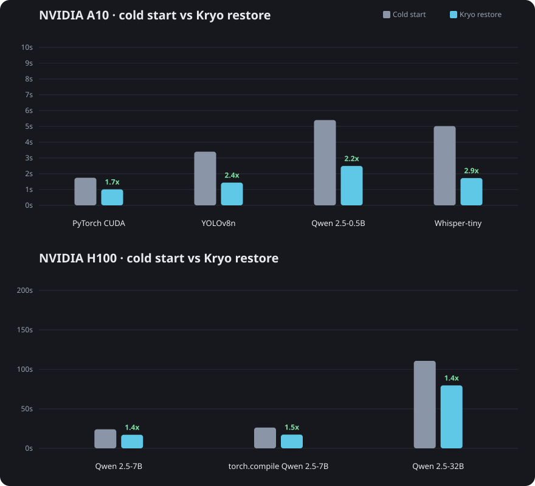

<div align="center">

# ❄️ Kryo

**Sub-second cold starts for GPU inference**

*pronounced 'cry-oh'*

[](https://www.rust-lang.org/) [](LICENSE)

</div>

---

## Table of Contents

- [❄️ Kryo](#️-kryo)
  - [Table of Contents](#table-of-contents)
  - [The Problem](#the-problem)
  - [The Solution](#the-solution)
  - [Requirements](#requirements)
  - [Installation](#installation)
  - [Limitations](#limitations)
  - [Usage](#usage)
    - [Create a snapshot](#create-a-snapshot)
    - [Restore and run](#restore-and-run)
    - [Manage snapshots](#manage-snapshots)
    - [Other](#other)
    - [Examples](#examples)
  - [Benchmarks](#benchmarks)
  - [Contributing](#contributing)

---

## The Problem

GPU inference has slow cold starts. A model that runs in milliseconds takes **5-10+ seconds to start**.

| Phase                                | Time      |
| ------------------------------------ | --------- |
| Python imports (torch, transformers) | 3-5s      |
| CUDA initialization                  | ~0.9s     |
| Model loading                        | 0.1-5s    |
| **Total cold start**                 | **5-11s** |

This makes serverless difficult and requires keeping instances warm to avoid startup overhead, defeating scale-to-zero.

## The Solution

Initialize once. Restore when the application starts.

```python
# app.py
import kryo

model = load_model()
model.to("cuda")
warm_up(model)

kryo.checkpoint()  # Snapshot creation stops here

serve(model)       # Production starts here after restore
```

1. **Create a snapshot during deployment.** This runs setup through
   `kryo.checkpoint()` and then saves the process.

```bash
kryo snapshot create --name llm -- python app.py
```

2. **Restore when starting the production process.** Execution resumes after
   `kryo.checkpoint()` with the initialized model in memory.

```bash
kryo run --snapshot llm
```

3. **Recreate the snapshot** when the code, model, dependencies, or runtime
   environment changes.

## Requirements

- Linux
- NVIDIA driver 550+
- [CRIU](https://criu.org/)
- [cuda-checkpoint](https://github.com/NVIDIA/cuda-checkpoint)

## Installation

Always install the CLI, CRIU, and cuda-checkpoint. The Python package is optional: only if you want `kryo.checkpoint()` in Python. Other languages use signals or `--wait` (see [Usage](#usage)).

`kryo snapshot create` and `kryo run` must be run as root (`sudo`). CRIU has to freeze and restore another process, which Linux does not allow for a normal user.

**Kryo CLI** (Linux x86_64 or arm64):

```bash
curl -fsSL https://raw.githubusercontent.com/akhileshsharma99/kryo/main/install.sh | sh
```

Or build from source:

```bash
cargo install --git https://github.com/akhileshsharma99/kryo
``` 

**CRIU** (Ubuntu):

```bash
sudo add-apt-repository -y ppa:criu/ppa
sudo apt-get update
sudo apt-get install -y criu
```

Other distros: [CRIU install docs](https://criu.org/Installation).

**cuda-checkpoint:** NVIDIA ships prebuilt binaries under [`bin/`](https://github.com/NVIDIA/cuda-checkpoint/tree/main/bin) (`x86_64_Linux`, `aarch64_Linux`). Put `cuda-checkpoint` on your `PATH`, or build from [NVIDIA/cuda-checkpoint](https://github.com/NVIDIA/cuda-checkpoint).

**Python package** (optional):

```bash
pip install kryo
```

## Limitations

Alpha. Linux + NVIDIA only. Recreate the snapshot when the code, model, CUDA toolkit, or NVIDIA driver changes. Restored processes are not portable across machines or driver versions.

## Usage

After setup, tell Kryo the process is ready to snapshot:

- **Python:** `import kryo` then `kryo.checkpoint()` (needs the optional package above)
- **Any other language:** block `SIGUSR2`, send `SIGUSR1` to the PID in `KRYO_CLI_PID`, then wait for `SIGUSR2`
- **Can't change the program:** skip signaling and use `--wait` so Kryo snapshots after N seconds

### Create a snapshot

```bash
# Signal-based (default) - your code calls kryo.checkpoint()
sudo kryo snapshot create --name <name> -- <command>

# Timer-based - checkpoint after N seconds (for code you can't modify)
sudo kryo snapshot create --name <name> --wait 30 -- <command>
```

### Restore and run

```bash
sudo kryo run --snapshot <name>
```

### Manage snapshots

```bash
kryo snapshot list                  # List all snapshots
kryo snapshot inspect <name>        # Show details
kryo snapshot delete <name>         # Delete a snapshot
```

### Other

```bash
kryo --version                      # Check version
kryo --help                         # Show help
```

### Examples

```bash
# Navigate to example
cd examples/python/qwen
uv sync

# Create snapshot (runs setup, freezes at kryo.checkpoint())
sudo kryo snapshot create --name qwen -- uv run python qwen.py

# Restore and run (sub-second cold start)
sudo kryo run --snapshot qwen
```

See [examples/](examples/) for more.

## Benchmarks

Time to first inference on a real NVIDIA GPU: a fresh Python process vs restoring a Kryo snapshot. The page cache is dropped first, so weights are read from disk like a new pod. Creating the snapshot is a deploy step, not part of the restore time.

<!-- BENCHMARK_RESULTS:START -->


release `v0.4.0`

**NVIDIA A10** · Lambda `gpu_1x_a10`

| Scenario | Cold start | Kryo restore | Speedup |
|----------|------------|--------------|---------|
| PyTorch CUDA | 1.75s | 1.01s | 1.7x |
| YOLOv8n | 3.40s | 1.44s | 2.4x |
| Qwen 2.5-0.5B | 5.40s | 2.49s | 2.2x |
| Whisper-tiny | 5.01s | 1.73s | 2.9x |

**NVIDIA H100** · Lambda `gpu_1x_h100_pcie`

| Scenario | Cold start | Kryo restore | Speedup |
|----------|------------|--------------|---------|
| Qwen 2.5-7B | 24.11s | 17.19s | 1.4x |
| torch.compile Qwen 2.5-7B | 26.34s | 17.37s | 1.5x |
| Qwen 2.5-32B | 110.75s | 79.66s | 1.4x |
<!-- BENCHMARK_RESULTS:END -->

How these are measured: [benchmarks/](benchmarks/).

## Contributing

See [CONTRIBUTING.md](CONTRIBUTING.md). Report vulnerabilities via [GitHub security advisories](https://github.com/akhileshsharma99/kryo/security/advisories/new), not public issues.
